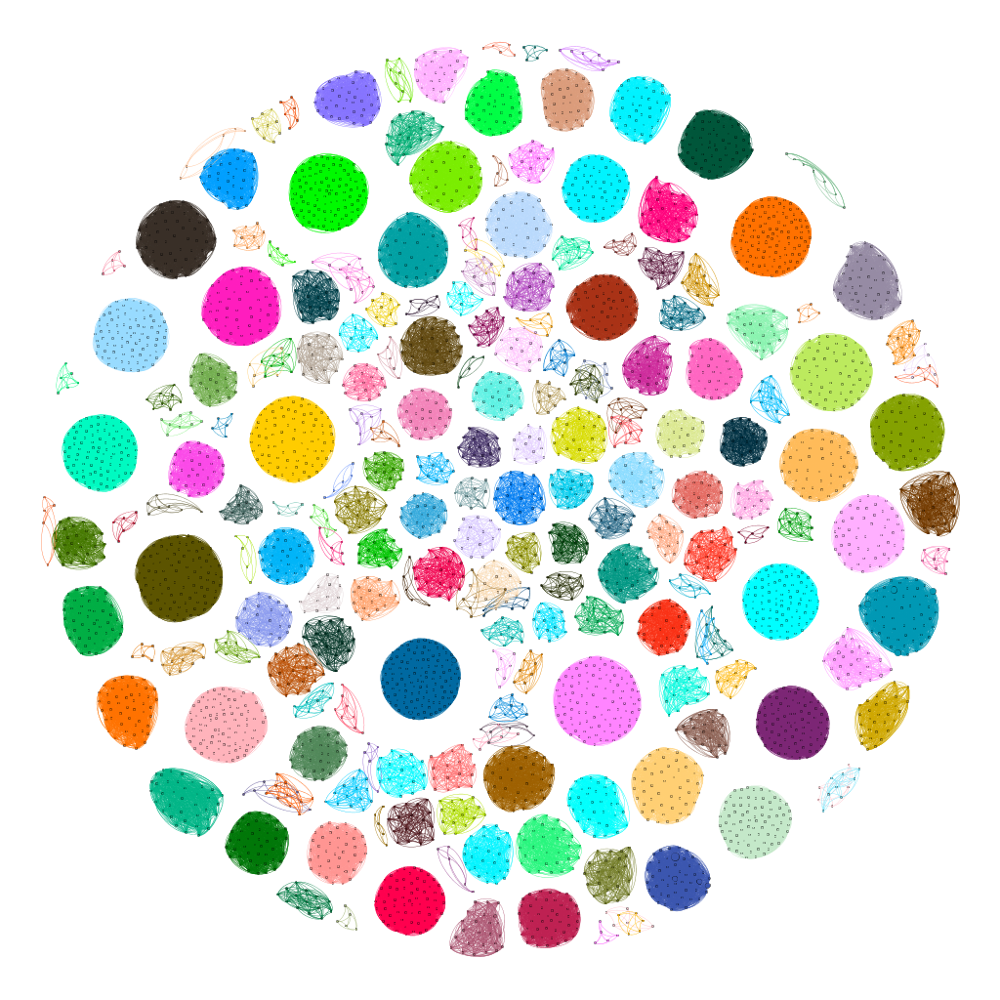

# Profile of Talent Projects Based on Knowledge Graphs
+ Constructed a basic dataset profiling authoritative talent projects in China (*Chang Jiang Scholars Program*, *National Science Fund for Distinguished/Excellent Young Scholars*, etc.) by crawling information concerning 14,969 scholars, including domain affiliations, annual citations, coauthor relationships, and institutional migrations
+ Retrieved award lists from National Science Foundation and National Institutes of Health for proposing a rank about institutes and enterprises according to Federal investments and principle investigators
+ Derived coauthor relationships to evaluate the clustering effect of institutes in various fields
+ Derived *Turing Indexes* for individual projects and awards as a reference for committees to filter applicants
## A demo of [Coauthorship Galaxy Map](https://acemap.info/demo1) has been released at [Acemap](https://acemap.info/).

---
Data concerning members/awardees from institutions/programs below are obtained/retrieved from [Microsoft Academic](https://preview.academic.microsoft.com):
1. [Chinese Academy of Sciences](http://english.cas.cn/)
2. [Chinese Academy of Engineering](http://en.cae.cn/en/)
3. [National Science Fund for Distinguished/Excellent Young Scholars](http://www.nsfc.gov.cn/english/site_1/index.html)
4. [10,000 Talents Plan](http://rencai.people.com.cn/GB/362597/370672/index.html)
5. [National Science Foundation](https://www.nsf.gov/)
6. [National Institutes of Health](https://www.nih.gov)